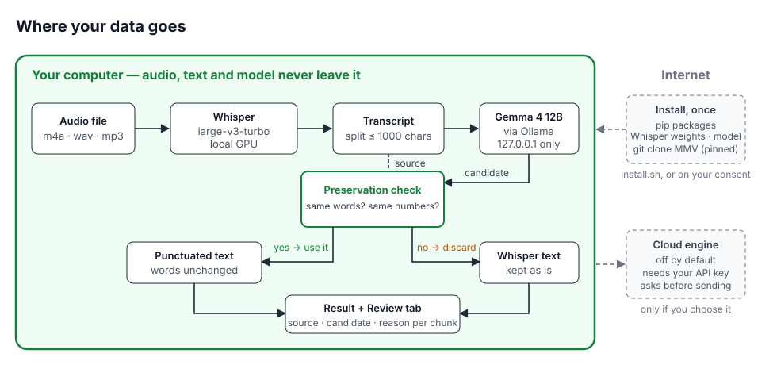
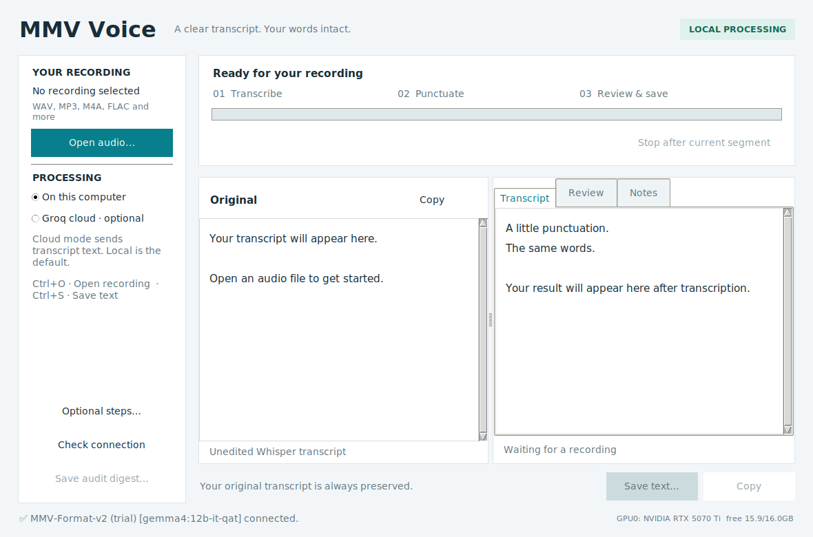
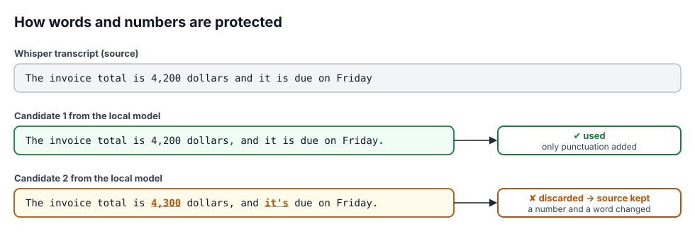

*The block above is Hugging Face Space metadata; it is not application configuration.*

# mmv-voice — private, local-first transcription (Whisper + a local model)

**Turn recordings into punctuated text on your own computer.** Your audio,
the transcript and the model all stay on your machine. No account, no API
key, no upload, no telemetry. And the local model is only allowed to add
punctuation: if it changes a single word or number, its output is thrown
away and Whisper's own text is kept.

## Local-first, concretely



- **Audio never leaves your computer.** Whisper runs locally (GPU if
  available, otherwise CPU).
- **The model is local, and the application enforces it.** Formatting goes
  to Ollama on a loopback address (`127.0.0.1`, `localhost`, `[::1]`); the
  application refuses any other address before it ever calls the model.
- **The network is used once, at install time.** `install.sh` downloads the
  Python packages, the Whisper weights, the local model and the MMV harness,
  asking before each download. After that, with the default settings, the
  tool makes no network calls while you work. If the Whisper weights are
  missing, the app asks before downloading them (model file only, never your
  audio). Opt-in extras differ: `pyannote.audio` speaker attribution fetches
  its model from Hugging Face on first use, and the cloud engine sends text
  after you confirm. (Third-party programs such as Ollama follow their own
  settings.)
- **Nothing to sign up for.** The default engine needs no account, key or
  licence server.
- **Cloud is opt-in, twice.** An optional cloud engine exists for people who
  want it; it is off by default, needs your own API key, and shows a
  confirmation dialog before any text is sent.
- **Your words are protected.** See [How your words are protected](#how-your-words-are-protected).

## Quick start

```bash
git clone https://github.com/mobius-style/mmv-voice && cd mmv-voice
bash install.sh --check   # shows what is missing; changes nothing
bash install.sh           # installs locally, asks before every download
bash launch.sh            # opens the app
```

Recording a meeting? Read [Long recordings](#long-recordings-meetings-what-to-expect-today)
first. Needs Linux with a desktop, Python 3.10+, `ffmpeg`, `python3-tk`, and
[Ollama](https://ollama.com/download) running. An NVIDIA GPU with 8–16 GB is
recommended; a single 16 GB card is enough. `install.sh` never uses `sudo` and
never starts or stops Ollama; it tells you the exact command when something
system-level is missing. Details and manual steps: [Setup](#setup).

## Using it

1. **Open an audio file** (m4a, wav, mp3 …). Transcription starts at once and
   streams into the left pane; the language is detected automatically.
2. **Formatting follows automatically.** The transcript is split into
   chunks of up to 1,000 characters and each chunk goes to the local model
   for punctuation and paragraph breaks.
3. **Read the result** in the right pane. Chunks whose candidate failed the
   word-and-number check are shown unformatted, exactly as Whisper wrote
   them.
4. **Check the "Review" tab** if you want to see, per chunk,
   the source, the model's candidate and why it was accepted or rejected.
5. **Save** the text, or (optional) export minutes or a digest file.
   "Stop after current segment" keeps the segments already shown, releases
   Whisper, then formats them. It does not interrupt a model call instantly, and
   text of the current 30-second window that was decoded but not yet displayed
   is discarded.



Use **Ctrl+O** to open a recording and **Ctrl+S** to save the selected result
tab as UTF-8 text. The original and result panes are read-only; copy or export
for editing. **Optional steps** holds the extra processing settings. Progress
shows the active stage and elapsed time; opening another file is disabled
until processing finishes.

Optional features — speaker attribution, an extra LLM fidelity pass,
minutes — are off by default and use the same local model. (If you
additionally install `pyannote.audio` for audio-based speaker attribution,
it downloads its models from Hugging Face the first time it runs.)

## How your words are protected



The check compares the words and numbers of every candidate with Whisper's
text (case-sensitive). Only punctuation and whitespace may differ. This is
enforced by code and covered by tests; it is not a formal proof, and it
cannot fix words that Whisper itself misheard. One consequence: if the model
changes capitalisation (for example on an all-lowercase English input), the
chunk falls back to Whisper's text unformatted.

A sibling of [mobius-style/mmv](https://github.com/mobius-style/mmv): every
LLM call goes through the MMV harness, never a raw API. v0.2 replaced the
v0.1 rewrite-style formatter with this minimal-edit one; v0.1 remains
available as tag `v0.1`. This is a local trial build: no fine-tuning, small
read-speech test panels, no claim of general model quality — measured
results and their limits follow below and in
[MMV_FORMAT_STATUS.md](MMV_FORMAT_STATUS.md).

## English results (the language this release is built around)

Everything — documentation, UI, prompts, tests — is written for English
first. v0.2.4 fixes the one English weakness found in v0.2: the prompt's
semicolon hint made the model add semicolons that do not belong (on the
2026-09-24 panel every changed clip gained one, and punctuation type-accuracy
fell from 0.681 to 0.500). v0.2.4 deletes that single sentence, nothing else.

Measured on 12 **new** English FLEURS clips (never used before), Whisper
large-v3-turbo, 3 temperature-0 runs per clip, punctuation scored
against the reference transcript:

| Output | Punctuation position F1 | Position + type F1 | Clips accepted |
|---|---:|---:|---:|
| Whisper alone | 0.846 | 0.821 | — |
| v0.2 formatter | 0.892 | 0.659 | 11/12 |
| **v0.2.4 formatter** | **0.878** | **0.854** | **11/12** |

- **Words are never changed.** Every delivered chunk has exactly Whisper's
  words and numbers; where a candidate changed anything (1 of 12 clips here),
  Whisper's text is kept. On the earlier 8-clip panel, 8/8 clips were kept
  word-for-word with 0 fallbacks.
- **Punctuation now roughly matches Whisper's own** on this panel (0.854 vs
  0.821 type-aware; the intervals overlap, so no difference is established),
  instead of clearly worse (v0.2: 0.659, an interval that does not overlap
  v0.2.4's). In practice v0.2.4 leaves Whisper's English punctuation alone on
  most clips (7 of 12 unchanged) and adds punctuation on 4.
- **Why the guarantee matters.** The rewrite-style formatter used up to v0.1
  can silently change words — on the 2026-09-24 clips it reworded a list and
  once returned a request for the transcript instead of formatted text.

Scope: small read-speech panels; 95% clip-bootstrap intervals overlap
(details in [eval/mmv_voice_v024_20260926.md](eval/mmv_voice_v024_20260926.md));
FLEURS is public, so overlap with the models' training data is unresolved.
Earlier record: [eval/mmv_format_12b_qat_20260924.md](eval/mmv_format_12b_qat_20260924.md)
(overall verdict HOLD, for Japanese).

## Long recordings (meetings): what to expect today

Tested on a real 17.5-minute, four-person meeting (AMI corpus ES2004a,
CC BY 4.0), on one RTX 5070 Ti:

- **Transcription works and is fast:** 32 s for the whole meeting including
  model load (27 s transcribing), whole-card VRAM peak about 5.7 GiB; word
  error rate 27% against the manual transcript
  (overlapping, informal speech).
- **Formatting mostly steps aside:** only **1 of 12** chunks was formatted;
  the other 11 were returned exactly as Whisper wrote them. Your words are
  safe, but on meetings you mostly get Whisper's own punctuation.
- **Observed causes:** in 6 chunks the MMV governance layer prepended a
  boilerplate sentence to conversational text; in the other 5 the model
  changed capitalisation — in 4 at a chunk that starts mid-sentence (the
  1,000-character split cuts sentences), plus mid-chunk changes such as
  "And" → "and"; one also dropped a repeated "Thank you". All are rejected
  by the word check, as designed. Two fixes were measured and are **on
  hold**: v0.3 (strip the known boilerplate before the check, split at
  sentence ends) raised the formatted share on a new held-out meeting from
  0/6 to 2/6 but missed its ≥50% gate on another; v0.3b added Whisper
  `condition_on_previous_text=False`, which removed the repetition loops on
  all three meetings and reached 4/5 formatted chunks, but on the new
  held-out meeting Whisper's automatic language detection then chose Dutch
  for an English meeting and WER rose from 43% to 85% (the two development
  meetings: +0.04 and −3.47 points). Reports:
  [v0.3](eval/mmv_voice_v03_20260926.md),
  [v0.3b](eval/mmv_voice_v03b_20260926.md).

## Reference: Mandarin Chinese

Exploratory, 8 FLEURS `cmn_hans_cn` clips, measured on v0.2.2 (`voice_mmv.py`
unchanged through v0.2.3; Chinese uses
the English prompt branch; v0.2.4's one-sentence English prompt change has
not been re-measured on Chinese). 7/8 clips accepted in all 3 identical
repeats (21/24 runs); the one rejected clip had a name separator changed and
fell back to Whisper's text. Whisper's Mandarin output is lightly punctuated,
and formatting raised punctuation-position F1 from 0.278 to 0.786 and
position+type F1 from 0.056 to 0.500; CER stayed 14.45% by construction.
Record: [eval/mmv_voice_zh_20260926.md](eval/mmv_voice_zh_20260926.md).

## What it does

1. **Transcription** — Whisper `large-v3-turbo` (GPU when available,
   language auto-detected). The raw log streams into the left pane.
2. **Formatting (default engine: MMV-Format, local)** — punctuation and
   paragraph breaks only. Each chunk's candidate must pass a
   lexical/numeric preservation check; otherwise the unformatted source is
   retained and the "Review" tab shows source, candidate and
   rejection reason.
3. **Speaker attribution (optional, off by default)** — pyannote.audio if
   installed and gated models are approved; otherwise text-based
   attribution through MMV. Output is structured as `Speaker 1: …` turns
   (`話者1:` for Japanese). Unattributable utterances stay visibly
   `Speaker unknown`.
4. **Fidelity check (optional, off by default)** — an additional LLM pass
   comparing each source/formatted pair; suspicious chunks get a ⚠️ marker.
5. **Minutes (optional, off by default)** — Markdown minutes
   (summary / key points / decisions / action items) from the formatted
   text, first 24,000 characters.
6. **Secretary digest** — one button writes
   `voice_note_<ts>.md` into the MOBIUS secretary digest directory with
   metadata, source/candidate/reason audit and `human_verified: false`.

## Engines

| Engine | Model | Runs on | Purpose |
|---|---|---|---|
| **MMV-Format** (default) | `gemma4:12b-it-qat` (Ollama) | local | punctuation-only formatting with preservation check |
| **MMV-L** (opt-in) | `gpt-oss-120b` via Groq | **cloud** | legacy path; sends transcript text off-machine after an explicit confirmation dialog |

- MMV-Format uses the profile shipped in this repository
  (`profiles/mmv_format_12b_qat.json`): MMV `route_transformer`,
  `post_validator` and `force_reanchor_v2` stay on, temperature 0,
  `num_ctx` 8192, `max_tokens` 1024, `think: false`. The canonical MMV
  release profiles are not modified.
- Before the first call, the tool checks that the Ollama model tag **and
  digest** match the evaluated build
  (`38044be4f923e5a55264ed7df4eaac2676651a905f735197c504045140c02bd3`).
  On mismatch it does not generate and keeps the source text; it never
  silently falls back to another model.
- Normally one generation request per chunk, no quality-driven
  regeneration. The harness's own retry on transport/empty-response errors
  (max 1) remains.
- Input is split at about 1,000 characters without cutting an ASCII word or
  a numeric expression; the split is checked to reconstruct the original
  string exactly. An oversized single token is retained unformatted rather
  than cut.
- MMV-L reads its binding from the MMV release pointer
  (`operate-fr-bench/releases/large/current.yaml`) and needs
  `GROQ_API_KEY` (environment or `MOBIUS_MMV/.env`). Without it the
  cloud radio button is disabled. The digest records which engine was used.

**This is not a transcription-error corrector.** A candidate that fixes a
misheard word is still rejected because the words changed. Punctuation can
change meaning, and the preservation check does not prove semantic
fidelity. Typo correction, summarisation and speaker attribution are
separate problems. Languages other than Japanese and English are
unevaluated.

## Measured results (summary)

From [MMV_FORMAT_STATUS.md](MMV_FORMAT_STATUS.md) and
[eval/mmv_format_12b_qat_20260924.md](eval/mmv_format_12b_qat_20260924.md), FLEURS read speech,
Whisper large-v3-turbo, 3 repeats per clip at temperature 0:

| Panel | Candidate acceptance | Actually formatted | Source retained | Punctuation-position F1 vs reference |
|---|---:|---:|---:|---:|
| **English, 12 new clips × 3 (2026-09-26), v0.2.4 prompt** | **11/12 clips** | 4/12 clips (12/36 runs); 7/12 unchanged | 1/12 clips | 0.846 → 0.878 (type-aware 0.821 → **0.854**) |
| English, 8 held-out clips × 3 (2026-09-24), v0.2 prompt | 8/8 clips | 7/8 (each added a semicolon the reference lacks) | 0/8 | 0.766 → 0.769 (type-aware 0.681 → 0.500) |
| English meeting, 17.5 min, 12 chunks (AMI ES2004a), v0.2.4 | 1/12 chunks | 1/12 | 11/12 | — (WER 27.2%, unchanged by design) |
| Mandarin, 8 clips × 3 (2026-09-26, reference; repeats identical) | 7/8 clips (21/24 runs) | 21/24 | 3/24 | 0.278 → 0.786 (type-aware 0.056 → 0.500) |
| Japanese, 12 new clips, v2 prompt | 91.7% (33/36) | 30/36 | 3/36 | 0.857 |
| Japanese, same clips, previous v1 prompt | 83.3% (30/36) | 24/36 | 6/36 | 0.857 |
| English, same 8 clips (regression, pre-release build, 1 run) | 8/8 | 6/8 | 0/8 | — |

Acceptance means the candidate passed the preservation check, not that its
punctuation is correct. The post-hoc punctuation-position F1 is identical
for v1 and v2 (paired delta +0.001, bootstrap 95% CI [−0.089, +0.088]); v2
misses fewer sentence ends but inserts more commas than the reference. The
panels are small; none of this is a population guarantee. The 2026-09-24
trial that was put on HOLD is kept unchanged in
[eval/mmv_format_12b_qat_20260924.md](eval/mmv_format_12b_qat_20260924.md).

## Repository layout

```
mmv-voice/
├── whisper_gui.py                 # GUI and pipeline
├── voice_mmv.py                   # MMV-Format engine: prompts, preservation check, splitting, audit
├── profiles/mmv_format_12b_qat.json
├── tests/test_mmv_formatter.py    # boundary and preservation tests (HTTP fixture, real harness path)
├── eval/                          # measured trials and raw metrics (JSON)
├── MMV_FORMAT_STATUS.md           # current adoption status and measurements
├── launch.sh / whisper_tool.desktop
├── requirements.txt
├── LICENSE                        # AGPL-3.0
└── README.md
```

Private audio, transcripts and local backups are ignored by `.gitignore`.
**Never commit audio files.**

## Requirements and tested environment

| Item | Tested with |
|---|---|
| OS | Linux (Tk desktop) |
| GPU | 2 × NVIDIA RTX 5070 Ti (16 GB); Ollama on GPU 0, Whisper on GPU 1 |
| Python | 3.10.14 (pyenv) |
| PyTorch | 2.10.0 + cu128 (Blackwell needs cu128 or newer) |
| Whisper | openai-whisper 20250625 |
| LLM | Ollama + `gemma4:12b-it-qat` (7.2 GB, Q4_0 QAT) |
| MMV harness | [mobius-style/mmv](https://github.com/mobius-style/mmv), `operate-fr-bench/harness/adapters.py` |

A single 16 GB GPU also works: Whisper is loaded only after the free VRAM
threshold (`MIN_FREE_VRAM_GB`, default 7 GB) is met, falls back to CPU
after a 30 s wait, and is released before formatting starts. The launcher
does **not** start or stop Ollama; an inference server belongs to whoever
started it.

## Setup

Recommended: `bash install.sh` (see [Quick start](#quick-start)). It performs
the steps below, skips what is already present, and writes `MMV_REPO` to a
local `.mmv-voice.env` that `launch.sh` reads. Manual equivalent:

```bash
# 1. system packages
sudo apt install ffmpeg python3-tk
# 2. PyTorch matching your CUDA (Blackwell example)
pip install torch torchvision torchaudio --index-url https://download.pytorch.org/whl/cu128
# 3. Python packages (openai-whisper, requests, pyyaml)
pip install -r requirements.txt
# 4. Ollama and the evaluated model (network and disk required, once)
ollama serve            # in another terminal, if not already running as a service
ollama pull gemma4:12b-it-qat
# 5. the MMV harness
git clone https://github.com/mobius-style/mmv ~/MOBIUS_MMV
export MMV_REPO=~/MOBIUS_MMV
```

Optional: `pip install pyannote.audio` and accept the Hugging Face gates
for `pyannote/speaker-diarization-3.1` and `pyannote/segmentation-3.0` for
audio-based speaker attribution.

## Run

```bash
bash launch.sh
```

or install `whisper_tool.desktop` (edit its `Exec=` path) and use the
desktop icon. Pick an audio file; transcription starts immediately and
formatting follows. "Stop after current segment" keeps the segments shown so
far and formats them after Whisper releases its resources (the remainder of the
current 30-second window is discarded).

## Configuration

Environment variables:

| Variable | Default | Meaning |
|---|---|---|
| `MMV_REPO` | `~/デスクトップ/mobius_ai/MOBIUS_MMV` | path of the MMV repository (harness + release pointers + digest dir) |
| `MMV_FORMAT_HOST` | `http://127.0.0.1:11434` | Ollama endpoint for MMV-Format; **loopback HTTP only**, anything else is refused |
| `WISPER_PYTHON` | pyenv 3.10.14, then auto-detect | interpreter used by `launch.sh` |
| `GROQ_API_KEY` | — | only for the opt-in MMV-L cloud engine |

Constants at the top of `whisper_gui.py`:

| Constant | Default | Meaning |
|---|---|---|
| `WHISPER_MODEL_SIZE` | `large-v3-turbo` | `large-v3` is more accurate, ~4.7× slower, needs ~11 GB |
| `WHISPER_LANGUAGE` | `None` (auto) | e.g. `"ja"` to pin the language |
| `MIN_FREE_VRAM_GB` | `7.0` | raise to `11.0` for `large-v3` |
| `FORMAT_CHUNK_CHARS` | `1000` | maximum characters per formatting request |

If the MMV harness or the formatting profile cannot be loaded, formatting
is disabled with a visible error; there is no silent fallback to a raw
model call.

## Review tab, minutes and digest

- **Review tab** — for every chunk: status (formatted /
  unchanged / source retained), reason, source text and model candidate.
  With the optional fidelity check on, the LLM verdicts are appended and
  flagged chunks are marked `⚠️` in the formatted text.
- **Notes tab** — Markdown; sections without content read "(none)"; the
  instruction forbids adding anything not in the transcript.
- **Secretary digest** — written to
  `$MMV_REPO/addons/secretary/state/digests/voice_note_<ts>.md` with
  source audio, language, engine, profile path, speaker backend, fidelity
  summary and `human_verified: false`.

## Tests

```bash
CUDA_VISIBLE_DEVICES="" xvfb-run -a python3 -m unittest discover -s tests -v
```

Desktop tests require Tk and Xvfb (or an existing display). They cover the
main-thread event queue, cooperative stop, save/export and minimum window
layout without loading a GPU model.

Covers the real harness path through a local HTTP fixture, rejection of
word/number changes, model-digest mismatch, exception handling that keeps
the exact source, splitting without cutting tokens, refusal of non-loopback
endpoints, and digest provenance. Passing tests are not a claim about
formatting quality; that comes only from held-out audio trials recorded in
`eval/`.

## Troubleshooting

| Message | Cause | Fix |
|---|---|---|
| `MMV not connected` | Ollama not running | start `ollama serve` (or the system service) |
| `gemma4:12b-it-qat with measured digest … is required` | model missing or a different build | `ollama pull gemma4:12b-it-qat`; a different digest is outside the evaluated configuration |
| `MMV configuration error` | `MMV_REPO` wrong or harness moved | set `MMV_REPO` |
| `MMV_FORMAT_HOST must be a loopback HTTP origin` | remote endpoint configured | use `http://127.0.0.1:<port>` |
| `No module named 'whisper'` | packages not installed | `pip install -r requirements.txt` |
| `ffmpeg not found` | ffmpeg missing | `sudo apt install ffmpeg` |
| `CUDA out of memory` | not enough VRAM | close other GPU applications, or let the tool fall back to CPU |

## Versions

| Tag | Date | Content |
|---|---|---|
| `v0.1` | 2026-07-06 | original release: MMV-M (`gemma4:12b`) via release pointer, filler removal and rewriting, fidelity check, speaker attribution, minutes, digest, opt-in MMV-L |
| `v0.2.6` | 2026-09-26 | sidebar layout fix for HiDPI displays (cloud-engine choice was clipped at 1.33× scaling); v0.3 / v0.3b HOLD reports added to `eval/`; stale "being measured" wording and diagram label updated |
| `v0.2.5` | 2026-09-26 | desktop UI refresh: one workspace (source and result side by side), main-thread event queue, sequential stop → release → format lifecycle, UTF-8 text export (Ctrl+O / Ctrl+S), elapsed time and explicit local/cloud state; responsive landing page. No change to prompts, profiles, validator or chunking |
| `v0.2.4` | 2026-09-26 | English prompt: semicolon hint removed (measured on 12 new clips); `install.sh` one-command local installer (also pre-fetches Whisper weights so work is offline); local-first README and diagrams; long-meeting result documented |
| `v0.2.3` | 2026-09-26 | documentation only: English results as the lead topic of the README and landing page; Mandarin reference measurement added in `eval/` |
| `v0.2.2` | 2026-09-25 | documentation only: local-first wording, Hugging Face metadata (v0.2.1 had invalid Space metadata) |
| `v0.2` | 2026-09-25 | default engine replaced by MMV-Format (punctuation-only, preservation check, digest pinning, audit in report); speaker / fidelity / minutes now off by default; English documentation; measured trials in `eval/` |

The v0.1 formatter rewrote text (filler removal, spoken-to-written style)
and relied on an LLM fidelity check to catch silent changes. v0.2 inverts
that: the model may only add punctuation, and a deterministic check
enforces it. If you need the old behaviour, check out tag `v0.1`.

## Local-first and privacy

- **No network at run time by default.** Whisper weights and the Ollama
  model are loaded from local disk; if the Whisper weights are missing, the
  app asks before downloading them (model file only). The formatter endpoint
  is restricted to loopback (`127.0.0.1` / `localhost` / `[::1]`) and the
  application refuses any other host.
- **Nothing leaves the machine unless you choose it.** Text is sent off-machine
  only when the MMV-L cloud engine is selected, and only after a confirmation
  dialog names the destination; the digest records which engine was used.
- **Your data is not part of this repository.** Audio, transcripts, digests
  and reference CSVs are git-ignored.
- **No telemetry, no accounts, no API keys** for the default path.

## License

AGPL-3.0 — Copyright (C) 2025-2026 MOBIUS LLC (author: Taiko Toeda).
Sibling of [mobius-style/mmv](https://github.com/mobius-style/mmv). The MMV
harness, frozen profiles and release pointers are artefacts of the mmv
repository; this repository contains only the application layer that calls
them.
